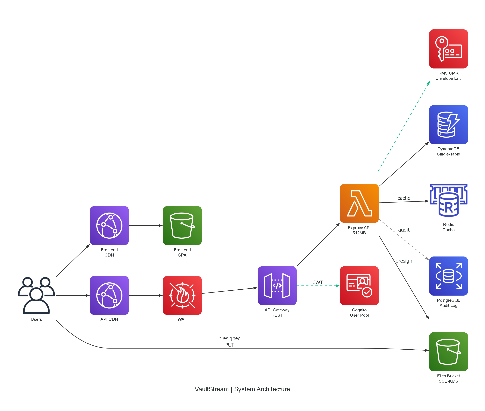
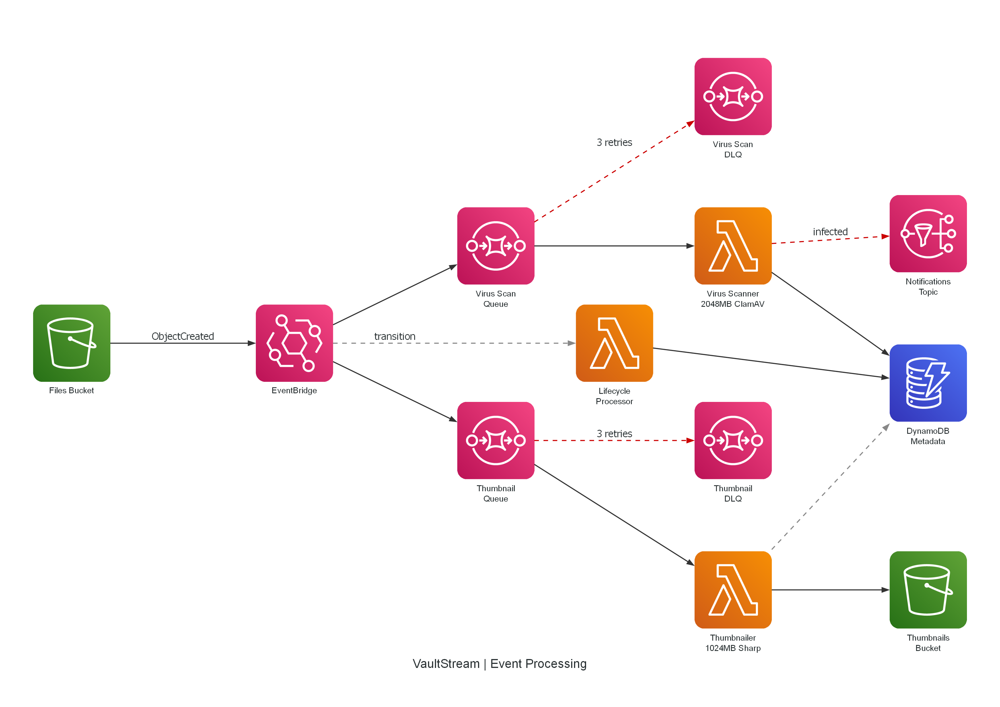
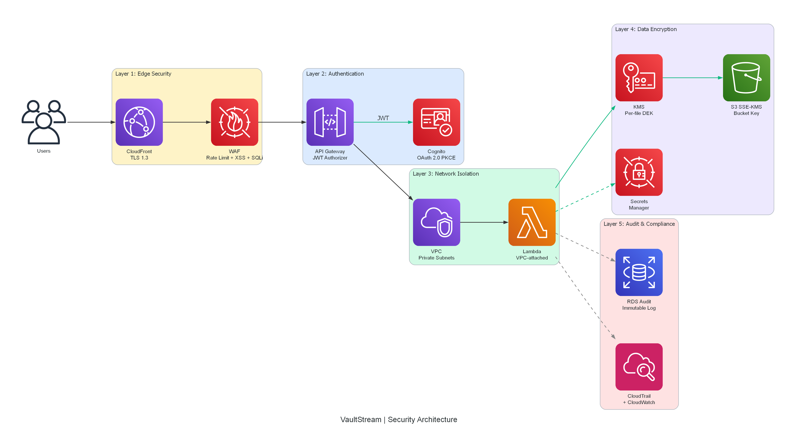

# VaultStream

**Encrypted File Vault with Intelligent Storage Tiering**

A secure, enterprise-grade file storage platform built entirely on AWS managed services. Users upload, encrypt, share, and manage sensitive documents through a modern web interface with zero-trust security, automatic cost-optimized storage tiering, and compliance-ready audit trails.



---

## Key Features

- **Presigned URL uploads** · Browser uploads directly to S3, no server bottleneck
- **Per-file KMS encryption** · Envelope encryption with unique data keys per file
- **Intelligent tiering** · S3 Standard → IA (30d) → Glacier IR (90d) → Deep Archive (365d)
- **File sharing** · Time-limited CloudFront signed URLs with granular permissions
- **Real-time caching** · Redis cache-aside pattern for sub-100ms reads
- **Compliance audit log** · Immutable PostgreSQL audit trail with read replica
- **Event-driven processing** · Thumbnail generation + virus scanning via SQS/Lambda
- **Global CDN delivery** · CloudFront with Origin Access Control

---

## Architecture

### System Overview


### Event Processing Pipeline



### Security Layers



---

## Tech Stack

| Layer | Technology |
|-------|-----------|
| Frontend | React 18, Vite, Tailwind CSS, TanStack Query |
| API | TypeScript, Express, Lambda via @vendia/serverless-express |
| Databases | DynamoDB (single-table), RDS PostgreSQL (audit), ElastiCache Redis (cache) |
| Storage | S3 (SSE-KMS, versioning, lifecycle), CloudFront (OAC + signed URLs) |
| Security | KMS (envelope encryption), Cognito (OAuth 2.0 PKCE), WAF |
| Compute | Lambda (API + thumbnails + virus scan + lifecycle) |
| Messaging | EventBridge, SQS (+ DLQs), SNS |
| IaC | AWS CDK v2 (TypeScript) |
| CI/CD | GitHub Actions (OIDC, no long-lived keys) |

---

## Project Structure

```
vaultstream/
├── packages/
│   ├── shared/          # Shared types, Zod schemas, constants, utilities
│   ├── api/             # Express API (Lambda-deployed)
│   ├── lambdas/         # Event-driven Lambda functions
│   └── frontend/        # React SPA
├── infra/               # AWS CDK infrastructure stacks
├── scripts/             # Dev utilities (seed, backup, init)
├── docs/                # Architecture diagrams
└── .github/workflows/   # CI/CD pipelines
```

---

## Quick Start

### Prerequisites

- Node.js 20+
- Docker Desktop (for local development)
- AWS CLI configured (for deployment)

### Local Development

```bash
# Install dependencies
npm install

# Start local infrastructure (LocalStack, PostgreSQL, Redis)
npm run dev:infra

# Seed test data
npm run dev:seed

# Start API + Frontend
npm run dev
```

### Running Tests

```bash
# All tests (487 unit + property tests)
npm test

# With coverage
npm run test:coverage

# Watch mode
npm run test:watch
```

### Generate Architecture Diagrams

```bash
pip install diagrams
python docs/generate_architecture.py
```

---

## AWS Services Used

| Category | Services |
|----------|----------|
| **Storage** | S3 (versioning, lifecycle, SSE-KMS), S3 Glacier, CloudFront (OAC, signed URLs) |
| **Databases** | DynamoDB (single-table, GSIs, TTL, PITR), RDS PostgreSQL (partitioned, read replica), ElastiCache Redis |
| **Compute** | Lambda (Express API, thumbnails, virus scan, lifecycle processor) |
| **Security** | KMS (envelope encryption), Cognito (PKCE), WAF, IAM (least privilege) |
| **Integration** | EventBridge, SQS (+ DLQs), SNS |
| **Observability** | CloudWatch (alarms, metrics, logs), X-Ray, CloudTrail |
| **Networking** | VPC, private subnets, NAT Gateway, VPC Endpoints (S3, DynamoDB, KMS, SQS) |

---

## Testing

| Layer | Tool | Count |
|-------|------|-------|
| Property tests | fast-check | 19 correctness properties |
| Unit tests | Vitest | 487+ tests |
| Integration | Supertest + LocalStack | API endpoint coverage |
| E2E | Cypress (scaffolded) | Critical user flows |

---

## Deployment

```bash
# Deploy to dev (automatic on merge to main)
git push origin main

# Deploy to production (on release tag)
git tag v1.0.0 && git push --tags
```

Pipeline: Lint → Test (80% gate) → Security scan → CDK deploy → Frontend S3 sync → CloudFront invalidation → Smoke tests

---

## Cost Estimate

| Environment | Monthly Cost |
|-------------|-------------|
| Development | ~$60/month (tear down RDS/Redis when idle → ~$5) |
| Production (1000 users) | ~$460/month |

---

## License

MIT
